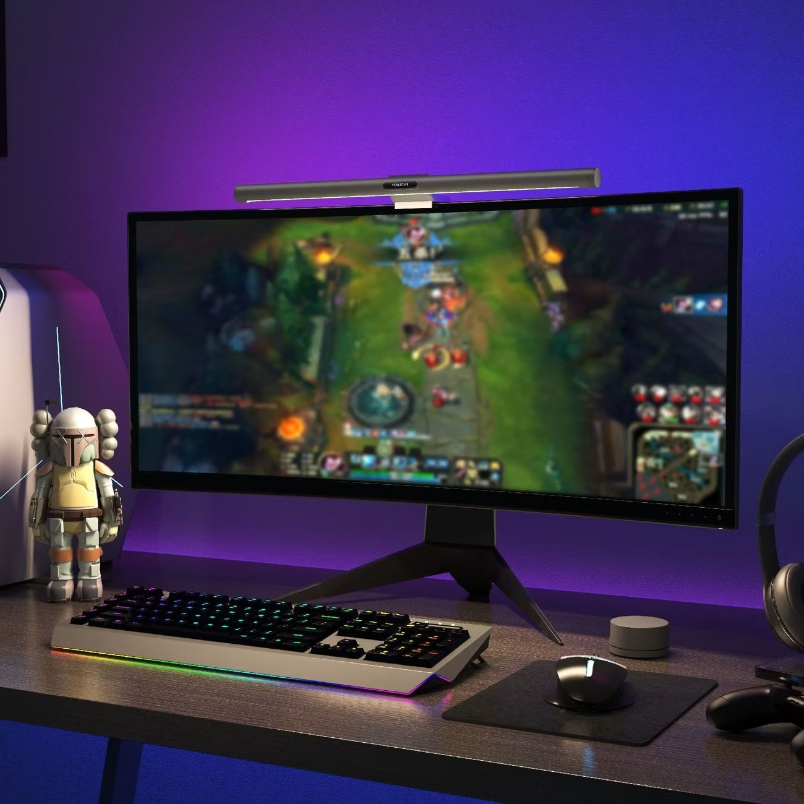

<h1 align="center">Zooblik_Yeelight_Screen-Light-Bar</h1>

<p align="center">
    ESPHome прошивка для Yeelight LED Screen Light Bar Pro (YLTD003)<br><br>
    
</p>

<h2 align="center">📌 Описание</h2>

<b>Данный проект</b> — это кастомная прошивка для **Yeelight LED Screen Light Bar Pro (YLTD003)** на базе [ESPHome](https://esphome.io/).  

**Основная цель** — Восстановление нерабочей лампы, которая обычно мигает и не включается

<div align="center">
<h3>Возможности:</h3>
**Работа с пультом дистанционного управления**<br>
**Интеграция с Home Assistant**<br>
**Поддержка WLED**
</div><br>


  
<p align="center"><i>По работе сравним Xiaomi Light Bar - те же самые жесты управления.</i></p>

<h2 align="center">✨ Возможности</h2>

- ✅ Управление с пульта:


| Действие                 | Функция                                    |
|---------------------------|--------------------------------------------|
| ▶️ Нажатие                | Включение / выключение **основного света** |
| ⏺️ Удержание              | Включение / выключение **RGB подсветки**   |
| 🔄 Вращение               | Регулировка **яркости**                    |
| 🔄⏺️ Вращение с удержанием | Регулировка **цветовой температуры**       |

<h3 align="center">⚠️ Известные ошибки:</h2>
  - В редких случаях ESP может перезагружаться (ошибка пока не отловлена, ведётся работа над устранением).  

<h2 align="center">🚀 Установка</h2>

1. Установите [ESPHome](https://esphome.io/guides/installing_esphome.html).  
2. Скачайте прошивку из репозитория.
3. Впишите свои логин:пароль от WiFi сети в файл main.yaml
4. Залейте её на устройство:  
   ```Команда в терминале:
   esphome run main.yaml
5. После прошивки подключите лампу к Wi-Fi и интегрируйте в Home Assistant.

<h2 align="center">🛠️ Планы на будущее</h2>

- Логирование и отладка ошибок перезагрузки   
- Оптимизация кода и стабильности работы  

<h2 align="center">🔗 Полезные ссылки</h2>

- 💬 [Обсуждение на форуме 4PDA](https://4pda.to/forum/index.php?showtopic=1103704)  
- 📖 [ESPHome документация](https://esphome.io/)  
- 🏠 [Home Assistant](https://www.home-assistant.io/)  

<h2 align="center">🤝 Благодарности</h2>

- [K-4U](https://github.com/K-4U/custom_components) за библиотеку на пульт управления
- [dckiller51](https://github.com/dckiller51/esphome-yeelight-led-screen-light-bar) за базу для проекта
- [ESPHome](https://esphome.io/) за отличную платформу  
- Сообщество Home Assistant за поддержку и идеи
